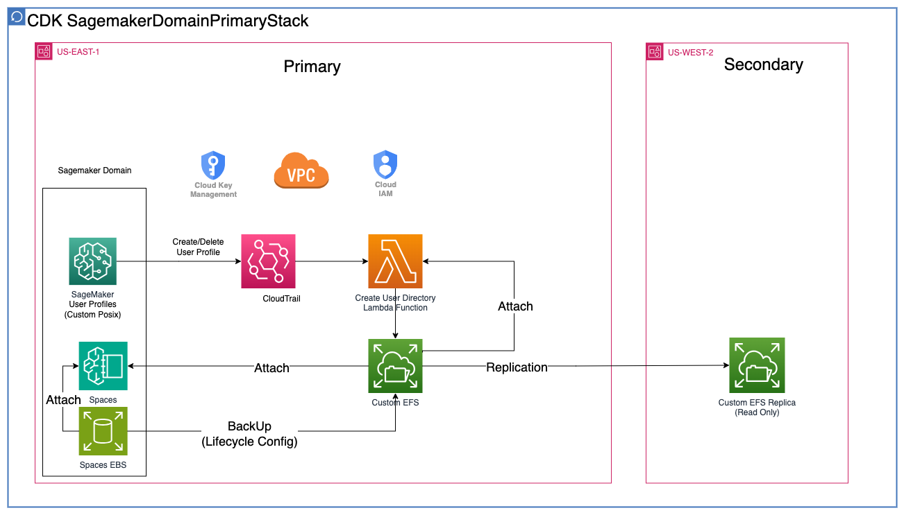
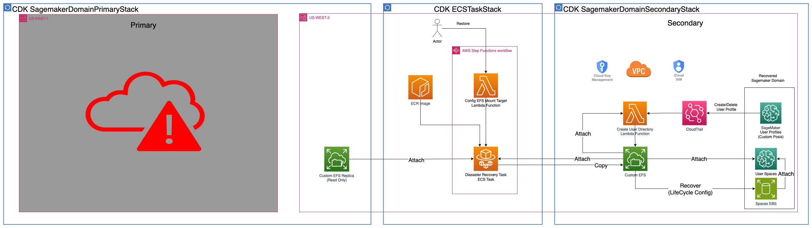
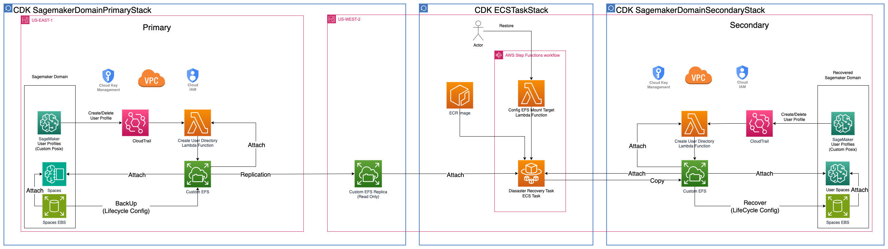

# SageMaker Domain Cross Region Disaster Recovery Using Custom EFS 

---

## Contents

* [Disaster Recovery Modes](#sagemaker-domain-dr-mode)
* [Deployment](#deployment)
* [Authors and Reviewers](#authors-and-reviewers)
* [License Summary](#license-summary)

---

## Sagemaker Domain DR Mode
### Active-Passive Mode
In this scenario, SageMaker Studio Domain is not setup in DR Region but cross region replication is enabled 
on the attached Custom EFS. 
<br />
<br />

<br />
<br />
When needed Studio Domain is spun up in DR Region and a step function is used to sync data 
from primary region's EFS Replica to DR region's Custom EFS.
<br />
<br />

### Active-Active Mode
In this scenario, SageMaker Studio Domain is set up in both Primary Region and DR Region, 
a step function is used to sync data from Primary Region's EFS Replica to DR region's Custom EFS.
<br />Tip: To extend this codebase for Active-Active DR, just simply add an event trigger for recovery step function


---

## Deployment
### Step 1: Deploy Primary Sagemaker Domain
```
cdk deploy SagemakerDomainPrimaryStack-NewStudio
```
### Step 2: Launch Primary Domain's Sagemaker Studio 
Navigate to primary region SageMaker Domain, and launch the chosen user's SageMaker Space, then create some test files
### Step 3: Deploy Secondary Sagemaker Domain
```
cdk deploy SagemakerDomainSecondaryStack-NewStudio
```
### Step 4: Deploy Disaster Recovery Step Function
```
cdk deploy ECSTaskStack-NewStudio
```
### Step 5: Execute Disaster Recovery Step Function
Navigate to AWS Step Functions in DR region, execute the Disaster Recovery Step Function deployed in step 4
### Step 6: Launch Secondary Domain's Sagemaker Studio 
Navigate to secondary region SageMaker Domain, and launch the same user's SageMaker Space, you will find your files backed up!


---

## Authors and reviewers

The following people are involved in the design, architecture, development, and testing of this solution:

1. **Jinzhao Feng**, Machine Learning Engineer, Amazon Web Services Inc.
2. **Nick Biso**, Machine Learning Engineer, Amazon Web Services Inc.
3. **Natasha Tchir**, Cloud Consultant, Amazon Web Services Inc.
4. **Katherine Feng**, Cloud Consultant, Amazon Web Services Inc.
---
## Security

See [CONTRIBUTING](CONTRIBUTING.md#security-issue-notifications) for more information.

## License

This library is licensed under the MIT-0 License. See the LICENSE file.
